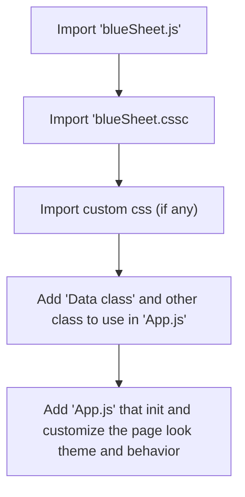

# blueSheet.js
Simple python kivy like (hopefully) js framework

# Html usage Structure

# Requirements
The js will try to load it's requirements auto with best optimization (that I know)
* hammer.js

# Browser support
* Since it uses `class`, so say goodbye to ES6 unsupported browsers. I'm too lazy to support older ones.
* List will be available in future
* Using pure js till now, jQuery may be used later
